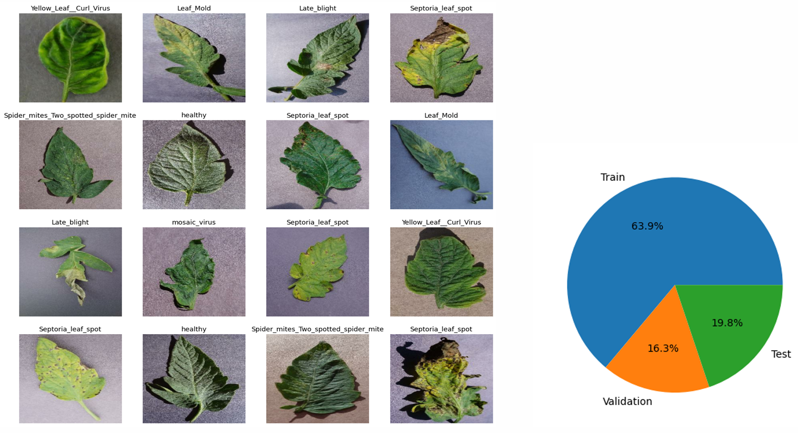
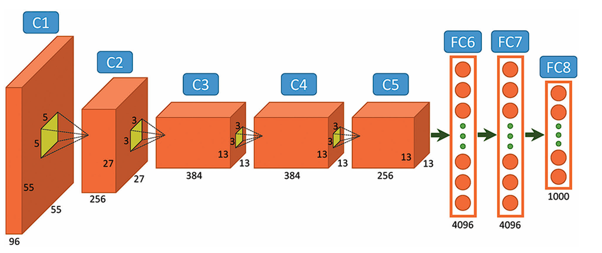
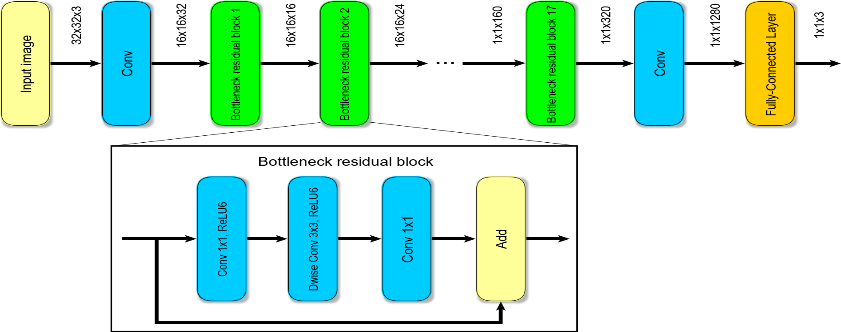
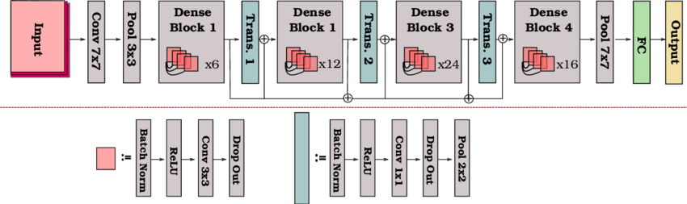
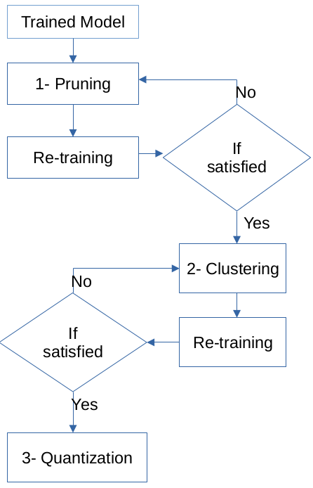
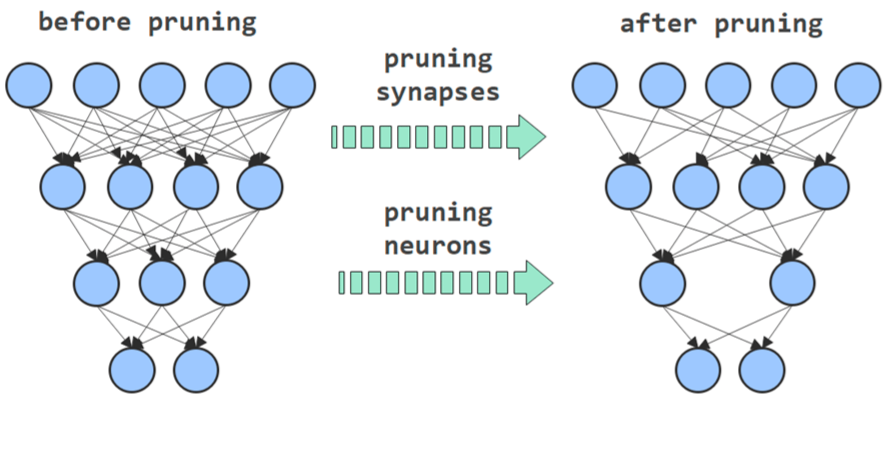
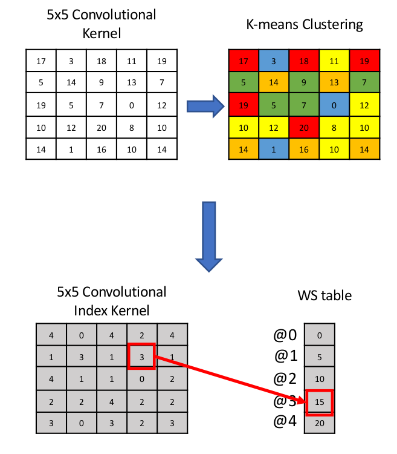
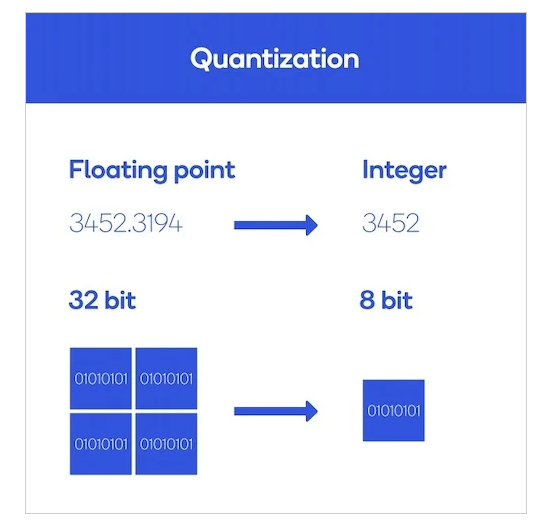
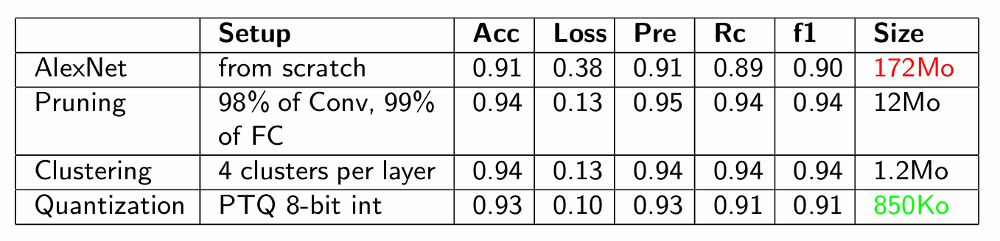

# 🍅 Tomato Leaf Disease Classification & TinyML Model Compression

## 📌 Project Overview


This project focuses on developing and optimizing deep learning models for tomato leaf disease classification, with the goal of deploying lightweight models on resource-constrained devices. Three Convolutional Neural Network (CNN) architectures were trained and evaluated for recognizing tomato leaf diseases: **AlexNet, MobileNet, and DenseNet**.

After training the models, several model compression techniques were applied to reduce their size and computational requirements while maintaining as much classification performance as possible. The optimization process includes: **Pruning, Weight clustering, and Quantization**

The project explores the trade-off between model size, computational efficiency, and classification performance, which is particularly relevant for TinyML and edge AI applications in precision agriculture.

## 🎯 Project Objectives

The main objectives of the project are to:

- Develop CNN-based models for tomato leaf disease recognition.
- Compare the performance of different CNN architectures.
- Reduce the size of trained models through compression techniques.
- Investigate the impact of compression on classification performance.
- Produce models suitable for deployment on resource-constrained devices.
- Explore the application of TinyML to agricultural disease detection.

#### 🌱 Disease Classification

The models are trained to distinguish between different tomato leaf conditions, including: **Healthy leaves, Bacterial Spot, Early Blight, and Other disease classes** included in the dataset



The classification pipeline processes tomato leaf images and predicts the corresponding disease category. The dataset consist of **10.000 images** and were split in three category: train, validation and test.


#### 🧠 Deep Learning Models

Three CNN architectures are investigated:

1. AlexNet

AlexNet serves as a baseline CNN architecture for evaluating image classification performance and the effect of subsequent compression techniques.



2. MobileNet

MobileNet is designed specifically for computationally constrained environments and provides a lightweight architecture suitable for edge and mobile applications.



3. DenseNet

DenseNet uses dense connections between layers to improve feature propagation and parameter efficiency while maintaining strong image classification capabilities. 



### ⚙️ Model Optimization

After training the models, different compression techniques are applied to reduce model size.



1. Pruning

Pruning removes less important weights from the neural network.

```
Original Model
      ↓
Identify Less Important Weights
      ↓
Remove / Zero Weights
      ↓
Pruned Model
```


The objective is to reduce the number of effective parameters while limiting the impact on classification accuracy.

2. Weight Clustering

Clustering groups similar model weights into a smaller number of representative values.

```
Original Weights
      ↓
Weight Clustering
      ↓
Reduced Number of Unique Values
      ↓
Compressed Model
```


This can reduce the storage requirements of the model and make it more suitable for deployment on constrained hardware.

3. Quantization

Quantization reduces the numerical precision used to represent model weights and/or activations.

For example:
```
Floating-Point Model
        ↓
Quantization
        ↓
Lower-Precision Model
        ↓
Reduced Memory Footprint
```


The goal is to reduce model size and computational requirements while maintaining acceptable predictive performance.

#### 📊 Model Evaluation

The models are evaluated before and after compression using metrics such as:

- Accuracy
- Loss
- Precision
- Recall
- F1-score
- ROC-AUC
- Model size
- Number of parameters

The results are used to analyze the trade-off between compression and predictive performance.

#### 🔬 Experimental Workflow

```
Tomato Leaf Dataset
        ↓
Data Preprocessing
        ↓
Train CNN Models
        ↓
┌───────────┬───────────┬───────────┐
│  AlexNet  │ MobileNet │  DenseNet │
└───────────┴───────────┴───────────┘
        ↓
Model Evaluation
        ↓
Model Compression
        ↓
┌──────────┬────────────┬────────────┐
│ Pruning  │ Clustering │ Quantization│
└──────────┴────────────┴────────────┘
        ↓
Compressed Models
        ↓
Performance & Size Comparison
        ↓
TinyML / Edge Deployment
```

#### 🛠️ Technologies
- Python
- TensorFlow / Keras
- NumPy
- Pandas
- Matplotlib
- Scikit-learn
- CNN / Deep Learning
- TensorFlow Model Optimization Toolkit

#### 📈 Results

The project compares the original and compressed models based on both classification performance and model size.

The analysis focuses on determining how much model compression can be achieved while maintaining an acceptable level of disease classification performance.



#### 🌾 Application: Precision Agriculture

The project demonstrates how deep learning and model compression can be combined to develop lightweight agricultural AI systems.

A compressed disease classification model could potentially be deployed on edge or embedded devices, allowing farmers or agricultural monitoring systems to identify plant diseases without relying entirely on cloud-based computation.

This makes the project relevant to:

- Precision Agriculture
- TinyML
- Edge AI
- Computer Vision
- Smart Farming
- Embedded Machine Learning

### 🚀 Key Skills Demonstrated
- Deep Learning
- Convolutional Neural Networks
- Image Classification
- Transfer Learning
- Computer Vision
- Model Pruning
- Weight Clustering
- Quantization
- Model Compression
- Performance Evaluation
- TensorFlow / Keras
- TinyML
- Edge AI
- Precision Agriculture